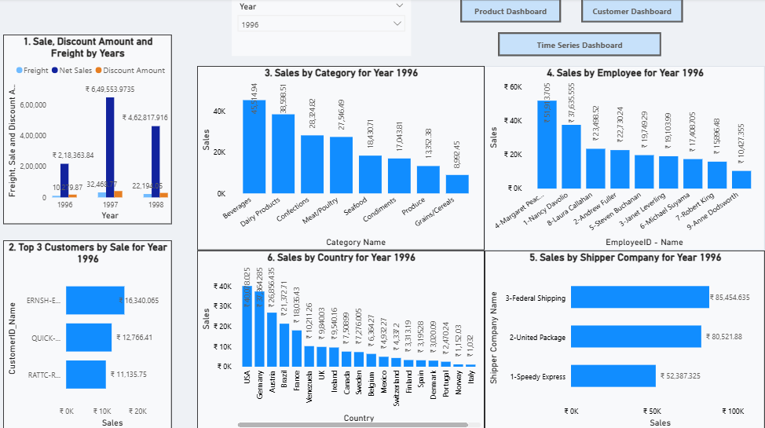
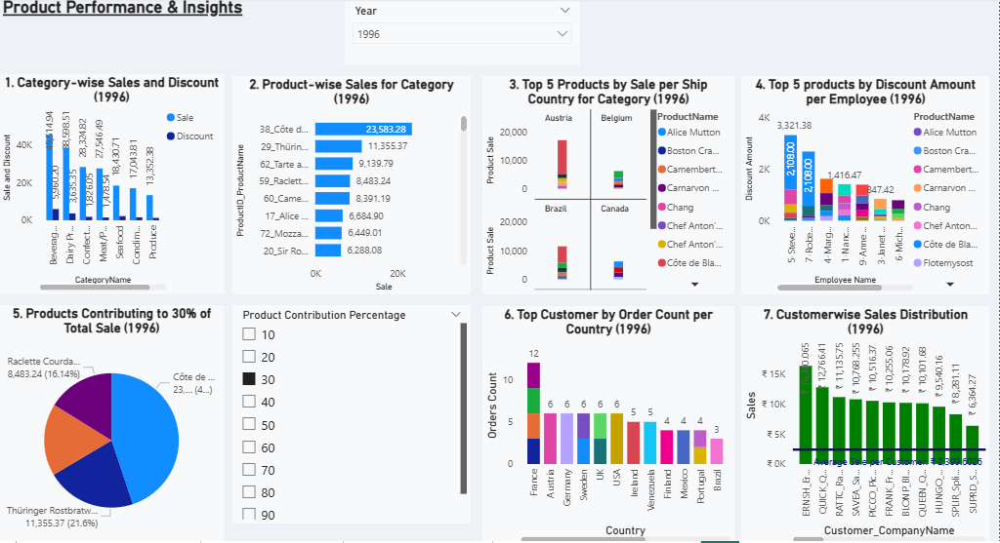
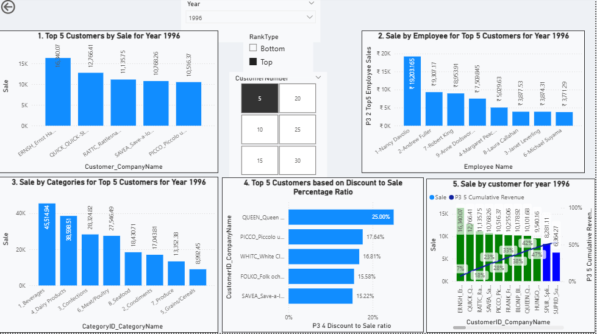
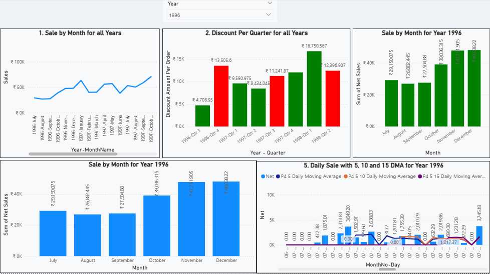

# 📊 Sales & Customer Analytics Dashboard (Power BI Project)

## 🚀 Short Description / Purpose  

This project is an end-to-end **Business Intelligence solution** built using **Microsoft Power BI** on the classic **Northwind Database**.  

The objective is to analyze:  
- 📈 Sales performance  
- 👥 Customer behavior  
- 📦 Product trends  
- ⏳ Time-series insights  

through interactive dashboards.  

It demonstrates strong capabilities in:  
- DAX calculations  
- Interactive reporting  
- Business KPI analysis  

---

## 🛠️ Tech Stack  

- 📊 **Microsoft Power BI** – Dashboard development & visualization  
- 🧠 **DAX (Data Analysis Expressions)** – Measures & calculations  
- 🗄️ **SQL** – Data extraction & transformation  

---

## 🗄️ Data Source  

- **Northwind Database**  

---

## ✨ Features / Highlights  

**🔹 Interactive Multi-Page Dashboard**  
- 4 fully connected report pages with navigation buttons  
- Dynamic filtering using slicers and parameters  
- Drill-down and cross-filtering enabled  

**🔹 Advanced Analytics Implemented**  
- Time Intelligence (MoM, YoY, Moving Averages)  
- Parameter-driven analysis (Top X, Contribution %)  
- Dynamic tooltips with contextual KPIs  
- Conditional formatting for business insights  
- Contribution and ranking analysis  

**🔹 Business Value**  
- Identify top-performing products and customers  
- Monitor sales trends and seasonality  
- Analyze discount impact on revenue  
- Track employee and regional performance  
- Make data-driven business decisions  

---

## 📸 Dashboard Preview  

### 🔹 Overview Dashboard  

### 🔹 Product Dashboard  

### 🔹 Customer Dashboard  

### 🔹 Time Series Dashboard  

